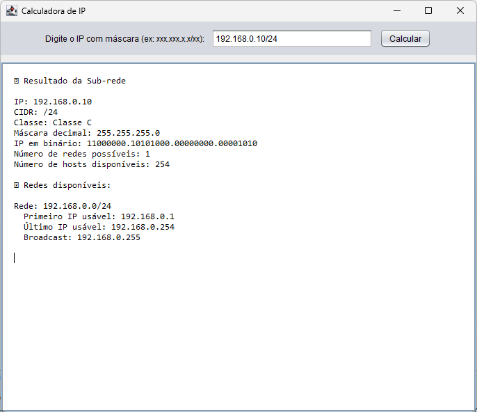

#Calculadora de IP
Este projeto é uma Calculadora de IP desenvolvida em Java, que agora conta com uma Interface Gráfica de Usuário (GUI). Ela foi criada para ajudar estudantes e profissionais de rede a entenderem detalhes sobre endereços IP e suas sub-redes de forma visual e interativa.

✨ Principais Funcionalidades:
* GUI Amigável: Permite inserir IPs e visualizar os resultados facilmente.
* Cálculos Abrangentes:
* Valida a entrada de IP com máscara (xxx.xxx.xxx.xxx/xx).
* Descobre a classe do IP (A, B, C, D, E).
* Gera a máscara de sub-rede decimal a partir do CIDR.
* Exibe o IP em formato binário.
* Calcula o número de sub-redes possíveis e a quantidade de hosts disponíveis por sub-rede.
* Lista detalhes completos de cada sub-rede, incluindo endereço da rede, primeiro/último IP utilizável e endereço de broadcast.
* Estilo Moderno: Tenta aplicar o tema visual Nimbus para uma melhor experiência.

Autor: Weslei Santos

